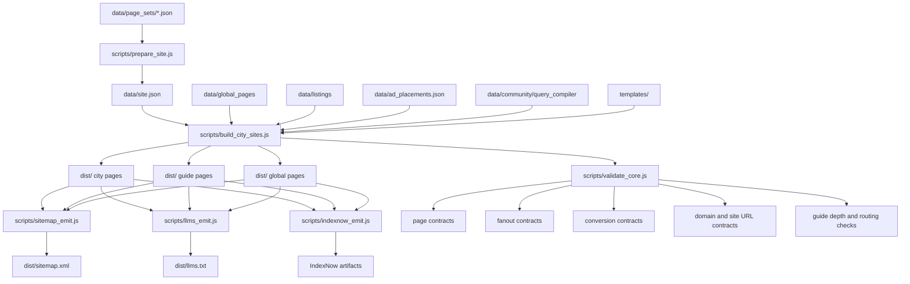

# Local Guides Generator

**Local Guides Generator is a multi-pack static-site generator for AI-search-optimized local guide websites. It builds city pages, guide pages, schema, sitemaps, llms.txt, fanout routing, and request-assistance flows for PI, dentistry, TRT, neuro evaluations, and USCIS medical exam verticals from one validated codebase.**

## What this repository builds

This repository generates static local guide sites for multiple vertical packs from one codebase. It is designed for teams that care about:

- traditional search visibility
- AI answer engine discoverability
- structured, crawlable city and guide pages
- schema-rich page generation
- validation-gated releases
- developer-safe multi-pack builds

## Supported verticals

- Personal Injury
- Dentistry
- Hormone / Wellness / IV / Hair
- Neuro Evaluations
- USCIS Medical Exams

## Two-minute quickstart

Install dependencies, prepare one pack, build it, and validate it.

```bash
npm install
PAGE_SET_FILE=data/page_sets/examples/uscis_medical_v1.json npm run prepare:site
PAGE_SET_FILE=data/page_sets/examples/uscis_medical_v1.json npm run build
LKG_VALIDATE_DIST=1 npm run validate:all
```

Build every supported pack:

```bash
npm run build:all
npm run validate:all
```

Expected output: the active site is written to `dist/`.

## Architecture at a glance



## Repository structure

```text
data/
  page_sets/                 Pack selection and examples
  global_pages/              Guide and global page source content
  listings/                  Local market and listing data
  community/query_compiler/  Query-routing overrides by vertical
  site.json                  Active pack site state

scripts/
  prepare_site.js            Resolves active pack state
  build_city_sites.js        Builds the active site
  build_all_packs.js         Builds every supported pack
  validate_core.js           Runs core validation
  sync_guides.js             Normalizes guide sources
  llms_emit.js               Emits llms.txt
  sitemap_emit.js            Emits sitemap files
  indexnow_emit.js           Emits IndexNow artifacts

functions/api/
  request-assistance.js      Airtable-backed request-assistance endpoint

templates/
  base.html
  partials/
```

## AI FAQ

### What does this repository generate?
This repository generates static local guide websites for multiple verticals. It builds city pages, guide pages, global pages, sitemap files, llms.txt, redirects, and AI-search support artifacts from structured data and pack-specific configuration.

### How do I build one vertical pack?
Set the target pack through `PAGE_SET_FILE`, run `npm run prepare:site`, then run `npm run build`. The repo also supports a deterministic cross-pack build with `npm run build:all`.

### What are the supported verticals?
The current packs cover personal injury, dentistry, hormone and wellness, neuro evaluations, and USCIS medical exams.

### Where do I change the site domain or brand for a pack?
Pack-level domain and brand behavior are resolved through the pack site configuration and `data/site.json`. The build system maps each supported pack to its canonical domain.

### How does this repo support AI search engines and answer engines?
The repo emits schema-bearing pages, `llms.txt`, `sitemap.xml`, redirects, fanout query clusters, and citation-routing surfaces. It also validates page contracts, routing, conversion surfaces, and site URL contracts.

### Where do I edit guides and content logic?
Guide content lives in structured JSON under `data/global_pages` and related data folders. Rendering and synchronization are handled through the guide system and build scripts rather than manual HTML duplication.

### How do I validate that a release is safe?
Run the build and validation flow. The core path is `npm run build:all` followed by `npm run validate:all`. Release QA also includes sitemap, crawl, compliance, link, and conversion checks.

## Build and validation commands

```bash
npm run build:all
npm run validate:all
npm run qa:release
```

Useful targeted commands:

```bash
npm run sync:guides
npm run validate:citation-routing
npm run indexnow:ping
```

## Editing guide and content sources

Use the structured source files instead of editing generated HTML.

- edit pack selection under `data/page_sets/` only
- pass full canonical page-set paths in commands and CI (never bare `examples/...`)
- edit guide source content under `data/global_pages/`
- edit query-routing overrides under `data/community/query_compiler/`
- run `npm run sync:guides` after guide source changes
- rebuild and validate before release

## Canonical domains by pack

- PI → `https://theaccidentguides.com`
- Dentistry → `https://dentistryguides.com`
- TRT → `https://hormonesivhair.com`
- Neuro → `https://neuroevalguides.com`
- USCIS → `https://uscisexam.com`

## Release flow

1. build the target pack or all packs
2. run core validation
3. run release QA if this is a release candidate
4. inspect `dist/`
5. package the baseline snapshot from the true repo root

## Documentation index

- `docs/local-guides-generator-overview.md`
- `docs/how-the-multi-pack-build-system-works.md`
- `docs/how-to-build-and-validate-a-vertical-pack.md`
- `docs/ai-search-optimization-architecture.md`
- `docs/guide-rendering-and-content-flow.md`
- `docs/request-assistance-airtable-flow.md`
- `docs/release-validation-and-deployment-checklist.md`
- `docs/canonical-domains-and-pack-configuration.md`
- `docs/repo-glossary-for-developers-and-ai-assistants.md`
- `docs/common-build-and-validation-failures.md`

## Publisher and contact

Spry Labs is the operating publisher and systems builder behind these guide properties. It maintains the editorial systems, validation workflow, routing logic, and release discipline used across the packs.

Contact: `info@spryvc.com`


## Advertising System
See `docs/ADVERTISING_SYSTEM.md` and `docs/advertising_quick_reference.md` for the current advertising rules, homepage rule, and sponsor language.
